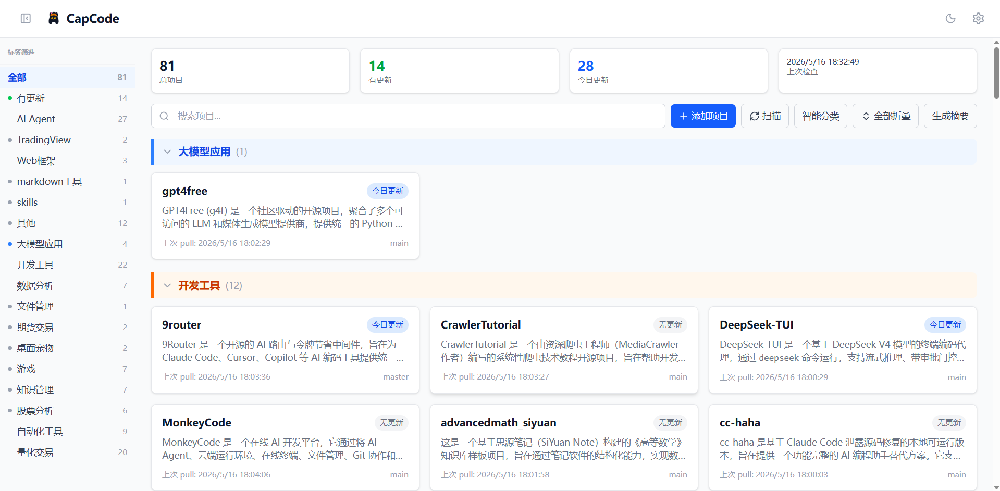
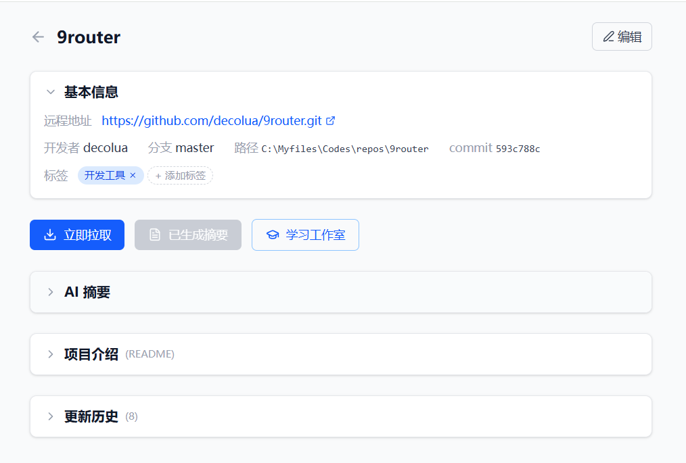
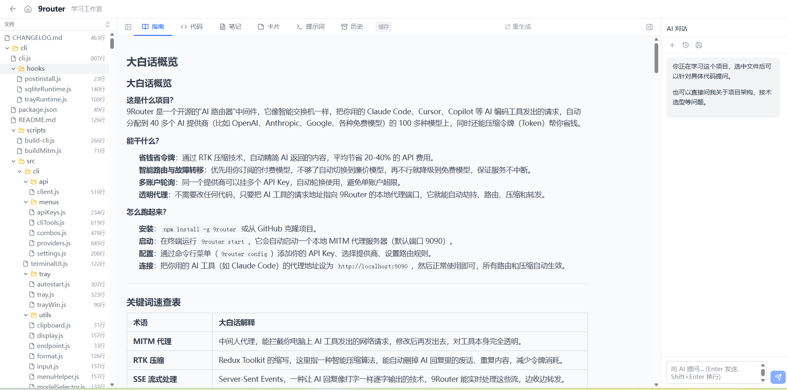
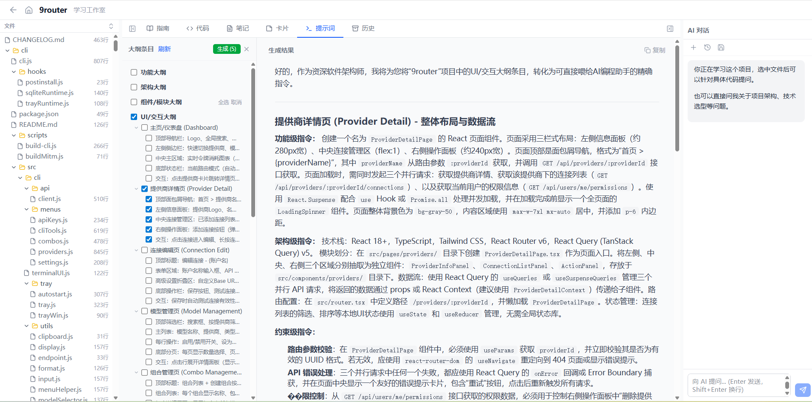

# CapCode

<p align="center">
  <b>本地开源项目管理器 — 自动 Git 同步、AI 摘要、智能分类、反向提炼提示词</b>
</p>

<p align="center">
  <a href="#-功能概览">功能概览</a> · <a href="#-快速开始">快速开始</a> · <a href="#-项目结构">项目结构</a> · <a href="#-赞助支持">赞助支持</a>
</p>

---

AI 智能时代，个体开发者可以快速学习开源项目。但克隆下来的开源项目多了，管理就成了大问题：几十上百个 repo 散落在硬盘里，记不清每个是做什么的、不知道哪些有更新、项目缺乏分类。CapCode 为此而生——把本地 repo 目录交给它，自动完成 Git 同步、AI 摘要生成、智能分类、更新发现，**甚至从项目中反向提炼精准 AI 提示词**，让你专注于学习和开发本身。

<p align="center">
  
</p>

---

## 功能概览

### 项目管理

<table>
  <tr>
    <td width="50%"><br><b>项目卡片与分类导航</b></td>
    <td width="50%"><br><b>AI 辅助学习工作室</b></td>
  </tr>
</table>

- **目录扫描** — 自动识别本地 Git 仓库，提取 README、commit 信息
- **多标签分类** — AI 智能打标签（量化交易、AI Agent、开发工具等），侧边栏筛选
- **定时/手动拉取** — 批量 git pull，终端风格实时 SSE 进度显示
- **GitHub Release 同步** — 显示当前版本完整 Release Notes（Markdown 渲染）
- **Gitee 支持** — 支持从 Gitee 克隆和管理仓库

### AI 摘要与分类

- **智能摘要** — 调用 DeepSeek API 分析项目，生成中文技术摘要（项目概述、技术栈、架构特点、值得学习的点）
- **智能分类** — AI 自动打标签，可手动调整
- **一键生成全部摘要** — 批量生成，SSE 实时进度反馈

### 学习工作室

<p align="center">
  
</p>

- **三栏布局** — 左侧文件树 + 中间内容区（指南/代码/笔记/卡片/提示词）+ 右侧 AI 对话
- **代码浏览** — 终端风格代码展示，行号高亮，AI 分析按钮
- **中英对照** — AI 翻译代码注释和文档，提取技术英语词汇制卡
- **笔记管理** — 创建/编辑/标签/删除，Markdown 渲染
- **SM-2 记忆卡片** — Anki 式间隔复习（忘记/困难/正常/简单四档评分），按标签/手动选择范围复习

### 提示词逆向工程（核心亮点）

从开源项目反向提炼精准 AI 编程指令，提高指挥 AI 的水平：

1. **6 维度大纲** — 功能/架构/模块/UI/数据/约束，两级树结构
2. **AI 展开提示词** — 将大纲条目展开为可直接喂给 AI 的精确指令
3. **历史管理** — 跨项目查看、收藏、标签分类、图片上传
4. **原地编辑** — 双击正文进入编辑，保存后无缝变回 Markdown 渲染

---

## 快速开始

### 环境要求

- Node.js 18+
- Git

### 安装

```bash
git clone https://github.com/xiaoqizheng0033/capcode.git
cd capcode
npm install
cd client && npm install && cd ..
```

### 配置

启动后访问 `http://localhost:3456/settings`：

| 配置项 | 说明 |
|--------|------|
| Repo 目录路径 | 存放开源项目的本地目录，如 `C:\Myfiles\Codes\repos` |
| 检查间隔 | 定时 pull 的小时间隔（默认 6 小时） |
| AI API Key | DeepSeek API Key（[获取地址](https://platform.deepseek.com)） |
| GitHub Token | 用于获取 Release 信息（可选，不加则限速 60次/小时） |

### 启动

```bash
npm run dev        # 开发模式（前后端并行）
npm run build      # 构建前端
npm start          # 生产模式 → http://localhost:3456
```

### 首次使用

1. 确保 Repo 目录下有 Git 仓库（或为空）
2. 点击"手动扫描"初始化项目列表
3. 点击"智能分类" + "生成摘要"（需配置 AI API Key）
4. 打开任意项目 → "学习工作室"开始学习

---

## 项目结构

```
capcode/
├── server/
│   ├── index.js                  # Express 入口
│   ├── db.js                     # SQLite 封装（sql.js WASM）
│   ├── routes/
│   │   ├── projects.js           # 项目 CRUD、clone、pull、release
│   │   ├── updates.js            # 更新历史查询
│   │   ├── config.js             # 配置读写
│   │   ├── call-chain.js         # 学习指南 & 大纲生成
│   │   └── learn.js              # 学习工作室 & 卡片 & 提示词
│   └── services/
│       ├── git-service.js        # git clone/pull（child_process + SSE）
│       ├── scanner.js            # 目录扫描 + AI 处理流水线
│       ├── ai-service.js         # DeepSeek API 调用
│       ├── code-analyzer.js      # 源码结构索引提取
│       ├── scheduler.js          # node-cron 定时 pull
│       └── translate.js          # Google Translate 英译中
├── client/
│   └── src/
│       ├── App.jsx               # 路由配置
│       ├── api.js                # 前端 API 封装
│       ├── pages/
│       │   ├── Dashboard.jsx     # 主页（项目列表、侧边栏）
│       │   ├── ProjectDetail.jsx # 项目详情
│       │   ├── LearnStudio.jsx   # 学习工作室（核心页面）
│       │   └── Settings.jsx      # 设置页
│       ├── components/           # 20+ UI 组件
│       └── hooks/                # 自定义 hooks（useResizable）
├── docs/
│   ├── pic/                      # README 截图
│   └── dev-log-2026-05-13.md    # 开发日志
├── data/                         # SQLite 数据库 + 上传文件（gitignore）
└── package.json
```

## 技术栈

| 层 | 技术 |
|---|---|
| 前端 | React 19 + React Router 7 + Tailwind CSS + Vite |
| 后端 | Express 4 + sql.js (SQLite WASM) |
| Git | simple-git + child_process |
| AI | DeepSeek Chat API |
| 文件上传 | multer |
| 定时 | node-cron |

---

## 赞助支持

如果这个项目对您有帮助，欢迎打赏支持 ❤️

<p align="center">
  
</p>
